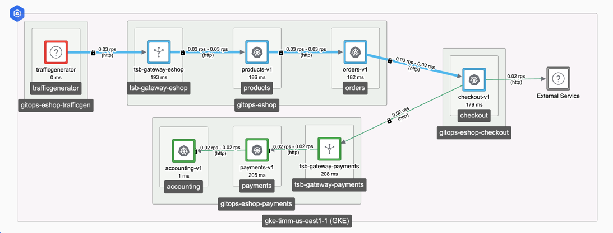

# generate-authz-tool

A simple CLI that calls TSB APIs via HTTP Basic Auth to extract your service topology, 
and prints a set of TSB Authorization Policies encoding your current topology. You can
apply them yourself via CURL or HTTPie, or include them as code in your CD pipeline.

## Install

```shell
go install github.com/tetrateio/generate-authz-tool
```
And then use the command:

```shell
$ generate-authz-tool --help
generate-authz-tool: a simple tool for creating TSB authz policies from TSB traffic data

Usage:
  generate-authz-tool [flags]

Flags:
      --debug                       Enable debug logging
      --end string                  End of the time range to query the topology in YYYY-MM-DD format (default "2023-05-08")
  -h, --help                        help for generate-authz-tool
  -p, --http-auth-password string   Password to call TSB with via HTTP Basic Auth. REQUIRED
  -u, --http-auth-user string       Username to call TSB with via HTTP Basic Auth. REQUIRED
  -k, --insecure                    Skip certificate verification when calling TSB
      --noverbose                   Disable verbose output; overrides --verbose (equivalent to --verbose=false)
      --org string                  TSB org to query against (default "tetrate")
  -s, --server string               Address of the TSB API server, e.g. some.tsb.address.example.com. REQUIRED
      --start string                Start of the time range to query the topology in YYYY-MM-DD format (default "2023-05-03")
      --verbose                     Enable verbose output, explaining why policy was generated; otherwise only the policy documents are printed. (default true)
```

> Note: Only HTTP Basic Auth is supported today!

Use the CLI to call TSB:
```shell
$ export \
  TSB_USER=YOUR_TSB_USER \
  TSB_PASSWORD=YOUR_TSB_PASSWORD \
  TSB_ADDRESS=YOUR_TSB_UI_ADDRESS

 $ generate-authz-tool -k \
    --http-auth-user $TSB_USER \
    --http-auth-password $TSB_PASSWORD \
    --server $TSB_ADDRESS
```

## Examples
Suppose we have the following service graph in TSB:



We can use the tool to call that TSB server and generate a set of policies:
```shell
$ go run github.com/tetrateio/generate-authz-tool -k \
    --http-auth-user $TSB_USER \
    --http-auth-password $TSB_PASSWORD \
    --server $TSB_ADDRESS
Observed the following traffic in the system from 2023-05-03 to 2023-05-08:

  organizations/tetrate/services/checkout.gitops-eshop-checkout is called by:
  - organizations/tetrate/services/orders.gitops-eshop

  organizations/tetrate/services/accounting.gitops-eshop-payments is called by:
  - organizations/tetrate/services/payments.gitops-eshop-payments

  organizations/tetrate/services/orders.gitops-eshop is called by:
  - organizations/tetrate/services/products.gitops-eshop

  organizations/tetrate/services/vmgateway.istio-system is called by:
    nothing

  organizations/tetrate/services/tsb-gateway-eshop.gitops-eshop is called by:
    nothing

  organizations/tetrate/services/tsb-gateway-payments.gitops-eshop-payments is called by:
  - organizations/tetrate/services/checkout.gitops-eshop-checkout

  organizations/tetrate/services/products.gitops-eshop is called by:
  - organizations/tetrate/services/tsb-gateway-eshop.gitops-eshop

  organizations/tetrate/services/payments.gitops-eshop-payments is called by:
  - organizations/tetrate/services/tsb-gateway-payments.gitops-eshop-payments

  organizations/tetrate/services/zipkin.istio-system is called by:
  - organizations/tetrate/services/vmgateway.istio-system
  - organizations/tetrate/services/checkout.gitops-eshop-checkout
  - organizations/tetrate/services/accounting.gitops-eshop-payments
  - organizations/tetrate/services/orders.gitops-eshop
  - organizations/tetrate/services/payments.gitops-eshop-payments
  - organizations/tetrate/services/products.gitops-eshop

They belong to the following groups:

  organizations/tetrate/tenants/eshop/workspaces/eshop/securitygroups/portal-security configures:
  - organizations/tetrate/services/tsb-gateway-eshop.gitops-eshop
  - organizations/tetrate/services/orders.gitops-eshop
  - organizations/tetrate/services/products.gitops-eshop

  organizations/tetrate/tenants/eshop/workspaces/eshop/securitygroups/checkout-security configures:
  - organizations/tetrate/services/checkout.gitops-eshop-checkout

The following policies need to be created:

POST "https://some.tsb.address.example.com/v2/organizations/tetrate/tenants/eshop/workspaces/eshop/securitygroups/portal-security/settings"
{
    "name": "default",
    "settings": {
        "authorization": {
            "mode": "CUSTOM",
            "serviceAccounts": [
                "gitops-eshop/sa-products",
                "gitops-eshop/tsb-gateway-eshop-service-account"
            ]
        },
        "description": "Generated 2023-05-08 by 'go run github.com/tetrateio/generate-authz-tool' based on traffic from 2023-05-03 to 2023-05-08 for services: organizations/tetrate/services/products.gitops-eshop, organizations/tetrate/services/tsb-gateway-eshop.gitops-eshop, organizations/tetrate/services/orders.gitops-eshop",
        "displayName": "Default",
        "fqn": ""
    }
}

The following policies need to be updated:

PUT "https://some.tsb.address.example.com/v2/organizations/tetrate/tenants/eshop/workspaces/eshop/securitygroups/checkout-security/settings/default"
{
    "authentication": "UNSET",
    "authenticationSettings": null,
    "authorization": {
        "mode": "CUSTOM",
        "serviceAccounts": [
            "gitops-eshop/sa-orders"
        ]
    },
    "description": "Generated 2023-05-08 by 'go run github.com/tetrateio/generate-authz-tool' based on traffic from 2023-05-03 to 2023-05-08 for services: organizations/tetrate/services/checkout.gitops-eshop-checkout",
    "displayName": "Default",
    "etag": "\"H7YqDIJtpT8=\"",
    "extension": [],
    "fqn": "organizations/tetrate/tenants/eshop/workspaces/eshop/securitygroups/checkout-security/settings/default",
    "propagationStrategy": "REPLACE",
    "waf": null
}
```

You can then update TSB with a tool like [HTTPie](https://httpie.io/) (`https`):
```shell
$ printf '
{
    "name": "default",
    "settings": {
        "authorization": {
            "mode": "CUSTOM",
            "serviceAccounts": [
                "gitops-eshop/sa-products",
                "gitops-eshop/tsb-gateway-eshop-service-account"
            ]
        },
        "description": "Generated 2023-05-08 by 'go run github.com/tetrateio/generate-authz-tool' based on traffic from 2023-05-03 to 2023-05-08 for services: organizations/tetrate/services/products.gitops-eshop, organizations/tetrate/services/tsb-gateway-eshop.gitops-eshop, organizations/tetrate/services/orders.gitops-eshop",
        "displayName": "Default",
        "fqn": ""
    }
}
' | https --verify=no -a $TSB_USER:$TSB_PASSWORD --json POST "https://some.tsb.address.example.com/v2/organizations/tetrate/tenants/eshop/workspaces/eshop/securitygroups/portal-security/settings"
```

### --noverbose / --verbose=false

Just print policies, without explanation:
```shell
$ go run github.com/tetrateio/generate-authz-tool -k \
    --http-auth-user $TSB_USER \
    --http-auth-password $TSB_PASSWORD \
    --server $TSB_ADDRESS \
    --noverbose
The following policies need to be created:

POST "https://some.tsb.address.example.com/v2/organizations/tetrate/tenants/eshop/workspaces/eshop/securitygroups/portal-security/settings"
{
    "name": "default",
    "settings": {
        "authorization": {
            "mode": "CUSTOM",
            "serviceAccounts": [
                "gitops-eshop/sa-products",
                "gitops-eshop/tsb-gateway-eshop-service-account"
            ]
        },
        "description": "Generated 2023-05-08 by 'go run github.com/tetrateio/generate-authz-tool' based on traffic from 2023-05-03 to 2023-05-08 for services: organizations/tetrate/services/tsb-gateway-eshop.gitops-eshop, organizations/tetrate/services/orders.gitops-eshop, organizations/tetrate/services/products.gitops-eshop",
        "displayName": "Default",
        "fqn": ""
    }
}

The following policies need to be updated:

PUT https://some.tsb.address.example.com/v2/organizations/tetrate/tenants/eshop/workspaces/eshop/securitygroups/checkout-security/settings/default
{
    "authentication": "UNSET",
    "authenticationSettings": null,
    "authorization": {
        "mode": "CUSTOM",
        "serviceAccounts": [
            "gitops-eshop/sa-orders"
        ]
    },
    "description": "Generated 2023-05-08 by 'tctl x gen-authz-policy' based on traffic from 2023-05-03 to 2023-05-08 for services: organizations/tetrate/services/checkout.gitops-eshop-checkout",
    "displayName": "Default",
    "etag": "\"H7YqDIJtpT8=\"",
    "extension": [],
    "fqn": "organizations/tetrate/tenants/eshop/workspaces/eshop/securitygroups/checkout-security/settings/default",
    "propagationStrategy": "REPLACE",
    "waf": null
}
```

### --debug

Prints a _ton_ of additional information, including all calls made to TSB, details of the service graph, and status of the computations the tool is running.

## Limitations
This is a proof of concept; a full version should be built into `tctl`.
- Only HTTP Basic Auth is supported; production deployments of TSB require OAuth or similar, so this is largly only good for demo
- If a Service is not selected by a Group (i.e. just inherits Workspace config), nothing is returned by TSB's `Lookup` API. We don't try to figure out the Workspace of Services without Groups, so no policy is generated for them. Future work would get a list of the Workspaces, and query their selectors to determine the Workspaces for each service without a Group. (Or the Services `Lookup` call can be updated to return Workspace in addition to Groups.)